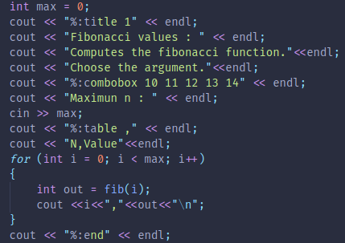
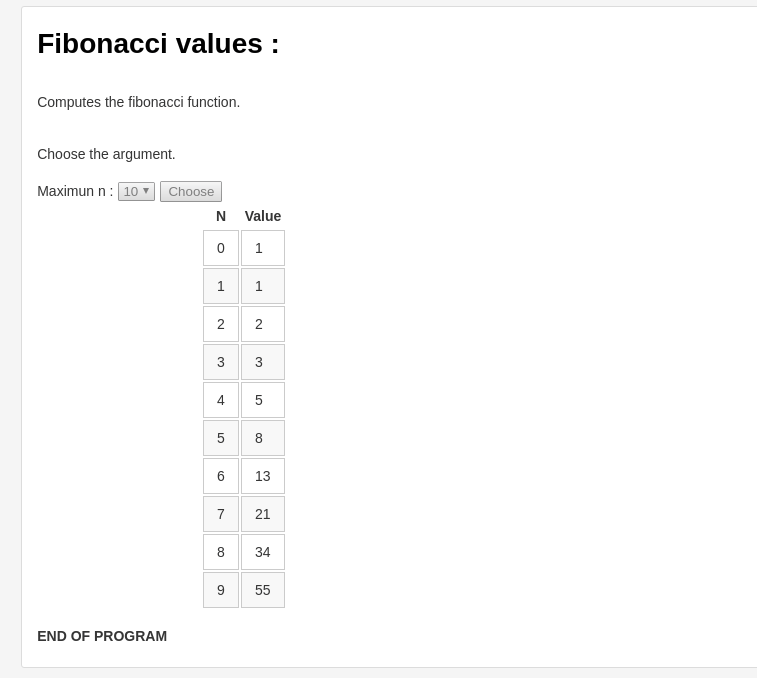

# Bifrost

Bifrost is an elecron application which allows to have prettier bash output by following a simple protocol.

# How to use

## Installation

Clone and build the application :

```bash
git clone https://github.com/CuadrosNicolas/Bifrost
cd Bifrost
npm run build
cd bifrost
./bifrost
```

## Usage


### Bifrost protocol

The bifrost protocol is a simple set of command that need to be sent through the standard output of your program,
you can see an example in C++ in the Examples/ folder.

Type of command :

- title X : make the next output the be a title of level X
- combobox *value*:... : create a combobox with value to be a succession the desired value separated by a space.
- input *type*: create an input of a certain type,the next output will also be the label next to the input, you can use any types of input from the html standard plus the *file* and *dir*.
- table *separator*: Make the next output to formed as a tabular, the separtor value define the column separator, the first output will be the header.
- end : end a tabular


### Use in the application

The top part of the application allows to navigate through your folder like a bash
using the *cd* command(you can also launch other command, but be careful, they must not need an entry for user since it's not supported).

Then, if you want to run your program which use the bifrost protocol just type *run* followed by your command.

### Special command

In the bash like interface you can also use special commands :
- kill : kill the current running process
- flush : clean the screen and history

### Ouput

In order to save the result of a program, a report.log and report.md is output by Bifrost in your current working directory in order to make reporting easier.

### Example

Here is an example in C++ which calculate the first value of the fibonacci function selected by the user using a combobox and print the result in a tabular :





## Author

[```Cuadros Nicolas```](https://github.com/CuadrosNicolas)
